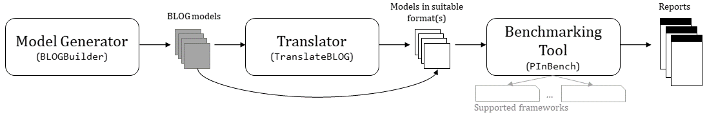

# ComPI 


In the absence of available benchmark datasets for probabilistic relational inference algorithms, we propose an extendable benchmarking suite named *ComPI* (**Com**pare **P**robabilistic **I**nference) that contains modules for automatic model generation, model translation and inference benchmarking. 

*ComPI* consists of the following modules (as outlined in the figure below):

* **[BLOGBuilder](#blogbuilder)** - A (BLOG) model generator
* **[TranslateBLOG](#translateblog)** - A model translator (from BLOG to other formats)
* **[PInBench](#pinbench)** - A benchmarking tool for various openly available probabilistic inference frameworks.



## Modules

### [`BLOGBuilder`](1_BLOGBuilder/)

*BLOGBuilder* is a module of *ComPI* that allows the automatic creation of series of BLOG model files that ideally increase in complexity. In this regard, multiple World Filling Strategies (as we call them) are available as explained in the README of *BLOGBuilder*.

More detailed information on *BLOGBuilder* is available in the README included in the download. 

#### Usage

The usage of *BLOGBuilder* is a little more sophisticated and explained in the corresponding README.

### [`TranslateBLOG`](2_TranslateBLOG/)

*TranslateBLOG* was developed as a means to translate BLOG model files into other different model representations.
It is based on the [GCFOVE implementation](https://dtai.cs.kuleuven.be/software/gcfove) by Taghipour (KU Leuven), mainly using their parser for BLOG files. 

More detailed information on *TranslateBLOG* is available in the README included in the download. 

#### Usage

Let `your_dir` be the path to the directory containing the BLOG files you want to have translated. Let's also say you want to have your BLOG files translated to the MLN format.

The according command line call would be:

```
$ java -jar TranslateBLOG.jar -f mln your_dir
```

This call creates a new sub-directory `your_dir/_TranslateBLOG` with all the BLOG files from `your_dir` translated into the desired format.

To obtain more information on how to use the jar file, use `java -jar TranslateBLOG.jar --help`.

### [`PInBench`](3_PInBench/)

*PInBench* is a **Bench**mark tool for **P**robabilistic **In**ference frameworks.
It facilitates timekeeping for multi-file, multi-query runs which allows comparison of the frameworks.

More detailed information on *PInBench* is available in the README included in the download. 

#### Supported Frameworks

The following frameworks are supported. Please note, that for licensing reasons you might need to download them from the respective original repositories. 

* [WFOMC / Forclift](https://dtai.cs.kuleuven.be/software/wfomc) (included as `forclift-3.1.jar` with some changes in the output, see *PInBench* README for more details)
* [GCFOVE](https://dtai.cs.kuleuven.be/software/gcfove) (*not* included. Needs to be supplied in the base directory as `gcfove.jar`)
  * Engines: `fove.LiftedVarElim`, `ve.VarElimEngine`
* [Alchemy 2.0](https://code.google.com/archive/p/alchemy-2/) (*just runs on Linux systems* - *not* included. Needs to be supplied in the base directory as `Alchemy_liftedinfer`)
  * Engines: `ptpe`, `lis`, `lvg`
* [LJT](https://www.ifis.uni-luebeck.de/index.php?id=590&L=0) (included as `fojt.jar`)
  * Engines: `fojt.LiftedJTEngine` (Lifted Junction Tree Algorithm, default), `jt.JTEngine` (Standard Junction Tree Algorithm) + standard GCFOVE engines(`ve.VarElimEngine`, `fove.LiftedVarElim`)
* [BLOG](https://bayesianlogic.github.io/) (*supported but was not implemented until the end because of different BLOG syntax between raw BLOG and GCFOVE - partly untested and buggy*) - not included

> Feel free to contact us, if you need assistance in locating or compiling the source files.

#### Usage

The script requires *Python 2.7*. It can be executed using a terminal, i.e. with `python PInBench.py`.
Help can be displayed using the extra argument `-h`:

```
$ python PInBench.py -h

positional arguments:
  directory             relative path to model file directory

optional arguments:
  -h, --help            show this help message and exit
  --framework {forclift,gcfove,jt,alchemy,blog}, -f {forclift,gcfove,jt,alchemy,blog}
                        framework to be benchmarked
  --verbose, -v         prints jar output and extracted information to console
                        (not to log)
  --engine {fove.LiftedVarElim,ve.VarElimEngine,fojt.LiftedJTEngine,jt.JTEngine,ptpe,lis,lvg}, -e {fove.LiftedVarElim,ve.VarElimEngine,fojt.LiftedJTEngine,jt.JTEngine,ptpe,lis,lvg}
                        inference engine to be chosen (if multiple available)
  --combinequeries, -cq
                        performs queries all at once (if possible), instead of
                        one by one
  --maxSampleSteps MAXSAMPLESTEPS, -ms MAXSAMPLESTEPS
                        maximum number of MCMC sampling steps (for Alchemy
                        sampling algos).
  --passThroughArgs PASSTHROUGHARGS, -pt PASSTHROUGHARGS
                        argument string that is simply passed through to the
                        engine. Enquoted with double quotes and presented with
                        equals sign between -pt and string -> -pt="ARGSTRING"
  --timeoutSkip, -ts    DEactivates Timeout exclude mode: if file_a.xyz leads
                        to timeout don't even start on bigger file_b.xyz with
                        b > a
  --timeout TIMEOUT, -t TIMEOUT
                        timeout (seconds) after which processes will be killed
  --java_xmx, -x        adds the java -Xmx16384M argument to the console calls
```

An example command line call: 

* evaluating a directory of BLOG files: `path/to/BLOG_dir`
* using the FOJT algorithm: `-f jt -e fojt.LiftedJTEngine` 
* all queries per BLOG file en bloque: `-cq` (combine queries) 
* allowing the JRE to occupy more memory `-Xmx16384M` argument: `-x`
* with a timeout of 5 minutes (= 300 seconds) per BLOG file: `-t 300`

```
$ python PInBench.py -f jt -e fojt.LiftedJTEngine -cq -x path/to/BLOG_dir
```

#### Outputs

Running the script produces the following output files:

* **`*.log` file**: Contains short logs of all mln-models that are used and every query that is executed on each of them. If something goes wrong (e.g. because the mln file is faulty or a Java Heapspace error), the java stacktrace is saved here.
* **`*times.csv` file**: Contains the collected data describing the engine execution (times, probabilities, tree sizes, ...). It is comma-delimited with a period as separator.
* **`*overview.log` file**: Contains a short overview (csv-format) with descriptions of the status of the handled files, like `all ok`, `timeout`, `NegativeArraySizeException`, `unspecified error`, ...

## Development

The modules of *ComPI* were developed with easy maintainability and custom extendibility in mind. Accordingly, the source code should have lots of explaining comments making it easily understandable.

Module-specific remarks regarding their individual development and contributions are made in the respective detailed README files.

## Licenses

Since some of the modules of *ComPI* are based on previous work of different authors, information on licenses and credits can be found in the individual subdirectories.